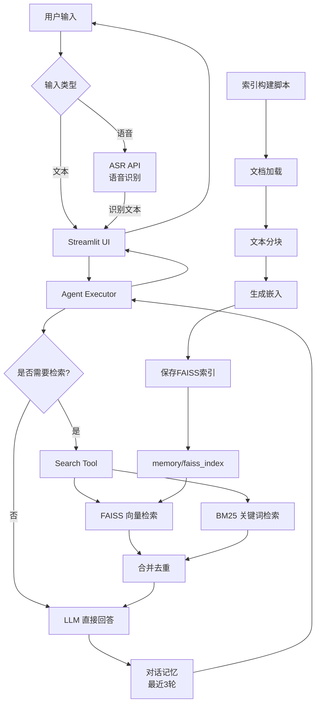

# 知觅 Agent 项目架构分析与执行入口

## 项目概述

知觅 Agent 是一个基于 LangChain 和硅基流动 Qwen2.5-7B-Instruct 的本地知识问答系统，支持多轮对话、混合检索（FAISS + BM25）、语音输入和防御式启动。

## 快速开始

### 1. 配置API Key


在项目根目录创建 `.env` 文件：

```env
SILICONFLOW_API_KEY=你的API_KEY
LLM_MODEL=Qwen/Qwen2.5-7B-Instruct
TELEAI_API_KEY=你的TeleAI_API_KEY
TELEAI_API_URL=https://api.teleai.com/v1/asr
TELEAI_MODEL=TeleAI/TeleSpeechASR
```

获取API Key:
- 硅基流动: https://cloud.siliconflow.cn/
- TeleAI: https://teleai.com/

### 2. 启动应用

```bash
# Windows
.\run.bat

# Linux/Mac
./run.sh
```

访问 http://localhost:8501

## 项目架构

### 目录结构

```
zhimi-agent/
├── zhimi/                    # 核心模块
│   ├── agent.py             # Agent 核心逻辑
│   ├── llm.py               # LLM 封装（硅基流动）
│   ├── asr.py               # 语音识别模块（TeleAI）
│   ├── tools/               # 工具模块
│   │   └── search_tool.py  # 混合检索工具
│   ├── prompts/             # 提示词模板
│   │   └── react_cn.txt     # 中文 ReAct 提示词
│   └── ui/                  # 用户界面
│       └── streamlit_app.py # Streamlit Web UI
├── scripts/                  # 工具脚本
│   └── index_local_docs.py # 知识库索引构建脚本
├── data/                     # 数据目录
│   └── sample/              # 示例文档
│       └── zhimi_readme.txt
├── memory/                   # 向量数据库存储
│   └── faiss_index/         # FAISS 索引文件
├── requirements.txt          # Python 依赖
├── run.sh                    # Linux/Mac 启动脚本
└── run.bat                   # Windows 启动脚本
```

### 核心模块分析

#### 1. LLM 模块 (`zhimi/llm.py`)

**功能**：封装硅基流动 API 调用

**关键特性**：
- 使用 `langchain_openai.ChatOpenAI` 兼容硅基流动 OpenAI 接口
- 从 `.env` 文件读取配置（`SILICONFLOW_API_KEY`, `LLM_MODEL`）
- 默认模型：`Qwen/Qwen2.5-7B-Instruct`（免费）
- Temperature: 0.2（保证回答稳定性）

**依赖**：`python-dotenv`, `langchain-openai`

#### 2. 检索工具模块 (`zhimi/tools/search_tool.py`)

**功能**：实现 FAISS + BM25 混合检索

**核心组件**：
- **FAISS 向量检索**：基于语义相似度的稠密检索
- **BM25 关键词检索**：基于关键词匹配的稀疏检索
- **防御式设计**：索引不存在时返回友好提示，不抛异常

**工作流程**：
1. 加载 FAISS 索引和 BM25 检索器
2. 对查询同时进行向量检索和关键词检索
3. 合并结果并去重
4. 返回相关文档片段

**嵌入模型**：`BAAI/bge-large-zh-v1.5`（中文优化）

#### 3. Agent 模块 (`zhimi/agent.py`)

**功能**：构建 ReAct Agent 执行器

**核心特性**：
- **ReAct 模式**：推理-行动-观察循环
- **多轮对话记忆**：`ConversationBufferWindowMemory(k=3)`，保留最近 3 轮对话
- **工具集成**：自动判断是否需要调用检索工具
- **中文提示词**：使用 `zhimi/prompts/react_cn.txt`

**Agent 决策逻辑**：
- 常识性问题 → 直接回答，不调用工具
- 本地文档/项目相关问题 → 调用 `search_local_knowledge` 工具

#### 4. 索引构建脚本 (`scripts/index_local_docs.py`)

**功能**：将本地文档构建为向量索引

**支持格式**：
- `.txt` - 文本文件
- `.pdf` - PDF 文档
- `.md`, `.markdown` - Markdown 文件

**处理流程**：
1. 递归扫描指定目录下的所有文档
2. 使用 `RecursiveCharacterTextSplitter` 分块（chunk_size=500, overlap=100）
3. 使用中文分隔符（`\n\n`, `\n`, `。`, `！`, `？`）
4. 生成嵌入向量并保存到 FAISS

#### 5. 语音识别模块 (`zhimi/asr.py`)

**功能**：封装 TeleAI/TeleSpeechASR API 调用

**关键特性**：
- 支持多种音频格式（WAV, MP3, M4A, OGG, FLAC, WEBM）
- 从 `.env` 文件读取配置（`TELEAI_API_KEY`, `TELEAI_API_URL`, `TELEAI_MODEL`）
- 自动音频格式转换（如需要）
- 完善的错误处理和提示

**依赖**：`requests`, `pydub`

#### 6. Web UI (`zhimi/ui/streamlit_app.py`)

**功能**：提供 Streamlit Web 界面

**界面特性**：
- 简洁的聊天界面
- 支持文本输入和语音输入（浏览器录音 + 文件上传）
- 实时显示 Agent 思考过程（verbose=True）
- 支持流式输入输出

## 数据流图



## 执行入口

### 方式一：使用启动脚本（推荐）

#### Windows 系统

```bash
# 在项目根目录执行
run.bat
```

**脚本功能**：
1. 检查虚拟环境是否存在
2. 激活虚拟环境
3. 检查索引是否存在，不存在则自动构建
4. 启动 Streamlit Web 服务

#### Linux/Mac 系统

```bash
# 在项目根目录执行
chmod +x run.sh
./run.sh
```

### 方式二：手动执行

#### 步骤 1：激活虚拟环境

**Windows**:

```powershell
.\zhimi-agent\Scripts\activate
```

**Linux/Mac**:

```bash
source zhimi-agent/bin/activate
```

#### 步骤 2：构建知识库索引（首次运行）

```bash
python scripts/index_local_docs.py --dir data
```

**参数说明**：
- `--dir data`: 指定要索引的文档目录

**输出**：
- 在 `memory/faiss_index/` 目录生成 FAISS 索引文件
- 显示构建的文档片段数量

#### 步骤 3：启动 Web 界面

```bash
streamlit run zhimi/ui/streamlit_app.py
```

**访问地址**：
- 默认：`http://localhost:8501`
- 浏览器自动打开

### 方式三：编程方式调用

```python
from zhimi.agent import load_agent

# 加载 Agent
agent = load_agent()

# 单次对话
result = agent.invoke({"input": "知觅是什么？"})
print(result["output"])

# 多轮对话（自动维护上下文）
result1 = agent.invoke({"input": "知觅的功能是什么？"})
result2 = agent.invoke({"input": "它支持哪些文档格式？"})  # 会记住上一轮对话
```

## 配置要求

### 环境变量配置

创建 `.env` 文件（参考 `.env.example`）：

```env
SILICONFLOW_API_KEY=your_siliconflow_api_key
LLM_MODEL=Qwen/Qwen2.5-7B-Instruct
TELEAI_API_KEY=your_teleai_api_key
TELEAI_API_URL=https://api.teleai.com/v1/asr
TELEAI_MODEL=TeleAI/TeleSpeechASR
```

**获取 API Key**：
1. **硅基流动**（LLM）：
   - 访问 [硅基流动控制台](https://cloud.siliconflow.cn/)
   - 注册/登录账号
   - 在控制台中创建或查看 API Key
   - 将 Key 填入 `.env` 文件的 `SILICONFLOW_API_KEY`
   
2. **TeleAI**（语音识别）：
   - 访问 [TeleAI 控制台](https://teleai.com/)
   - 注册/登录账号
   - 在控制台中创建或查看 API Key
   - 将 Key 填入 `.env` 文件的 `TELEAI_API_KEY`

**模型说明**：
- **LLM 模型**：`Qwen/Qwen2.5-7B-Instruct`（硅基流动免费提供）
  - API 地址：`https://api.siliconflow.cn/v1`（OpenAI 兼容接口）
  - 支持通过 `LLM_MODEL` 环境变量切换其他模型
  
- **ASR 模型**：`TeleAI/TeleSpeechASR`（TeleAI 提供）
  - API 地址：`https://api.teleai.com/v1/asr`（默认，可通过 `TELEAI_API_URL` 自定义）
  - 支持通过 `TELEAI_MODEL` 环境变量切换其他模型

### 依赖安装

确保虚拟环境已激活，然后：

```bash
pip install -r requirements.txt
```

**主要依赖**：
- `langchain>=0.3.0` - Agent 框架
- `langchain-openai>=0.2.0` - LLM 接口
- `langchain-community>=0.3.0` - 社区工具
- `faiss-cpu>=1.7.4` - 向量数据库
- `streamlit>=1.40.0` - Web UI
- `sentence-transformers>=2.7.0` - 嵌入模型
- `rank-bm25>=0.2.2` - BM25 检索
- `pydub>=0.25.1` - 音频处理
- `requests>=2.31.0` - HTTP 请求
- `streamlit-audio-recorder>=0.0.8` - Streamlit 录音组件

## 使用示例

### 示例 1：询问本地文档内容

```
用户：知觅是什么？
Agent：[调用 search_local_knowledge 工具]
      [检索到：知觅（Zhimi）是一个基于硅基流动 Qwen2.5-7B-Instruct 的本地知识问答 Agent。]
      [回答：知觅是一个基于硅基流动 Qwen2.5-7B-Instruct 的本地知识问答 Agent...]
```

### 示例 2：常识性问题（不调用工具）

```
用户：今天天气怎么样？
Agent：[不调用工具，直接回答]
      [回答：我无法获取实时天气信息...]
```

### 示例 3：多轮对话

```
用户：知觅支持哪些文档格式？
Agent：[调用工具检索]
      [回答：支持 .txt, .pdf, .md 格式...]

用户：如何添加新文档？
Agent：[基于上下文，调用工具检索相关实现细节]
      [回答：将文档放入 data 目录，然后运行索引脚本...]
```

### 示例 4：语音输入

```
用户：[录音] "知觅是什么？"
ASR：[识别] "知觅是什么？"
Agent：[调用工具检索]
      [回答：知觅是一个基于硅基流动 Qwen2.5-7B-Instruct 的本地知识问答 Agent...]
```

## 故障排查

### 问题 1：索引未构建

**症状**：Agent 返回 "⚠️ 本地知识库尚未构建"

**解决**：

```bash
python scripts/index_local_docs.py --dir data
```

### 问题 2：API Key 未配置

**症状**：LLM 调用失败

**解决**：
1. 检查 `.env` 文件是否存在
2. 确认 `SILICONFLOW_API_KEY` 已正确配置
3. 验证 API Key 是否有效（可在硅基流动控制台查看）

### 问题 3：依赖缺失

**症状**：导入错误

**解决**：

```bash
pip install -r requirements.txt
```

### 问题 4：语音识别失败

**症状**：ASR API 调用失败

**解决**：
1. 检查 `.env` 文件中是否配置了 `TELEAI_API_KEY`
2. 确认 `TELEAI_API_URL` 是否正确
3. 验证 API Key 是否有效（可在 TeleAI 控制台查看）
4. 检查音频格式是否支持（WAV, MP3, M4A, OGG, FLAC, WEBM）
5. 确认音频文件大小未超过 API 限制

## 扩展建议

1. **添加更多文档格式**：在 `scripts/index_local_docs.py` 的 `load_docs` 函数中添加新的加载器

2. **调整检索参数**：修改 `search_tool.py` 中的 `k` 值（检索数量）

3. **自定义提示词**：编辑 `zhimi/prompts/react_cn.txt` 调整 Agent 行为

4. **添加新工具**：在 `zhimi/tools/` 目录创建新工具，并在 `agent.py` 中注册

